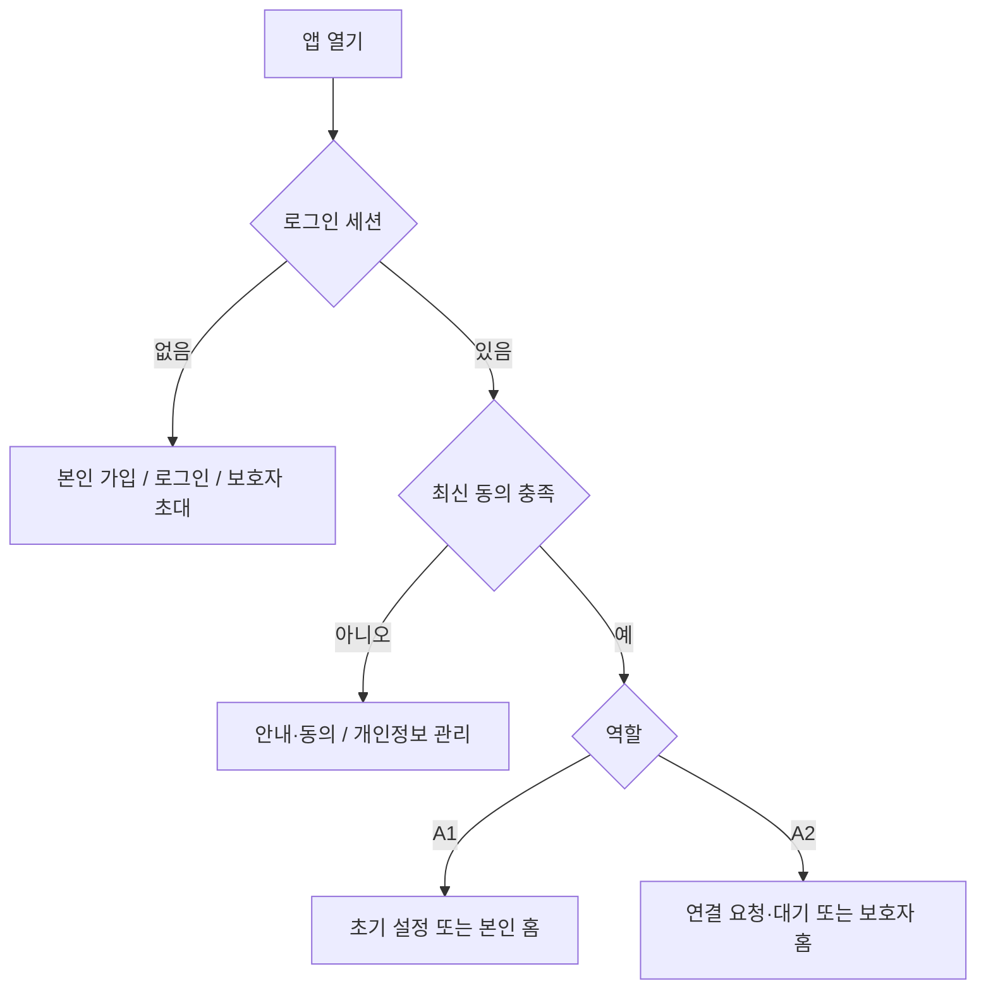

# DentureCare 웹 개발 명세서 · Codex 인수인계

작성일: 2026-09-27 · 문서 버전: 1.0 · 제품명: 틀니케어(DentureCare)

**이 문서는 기존 앱을 이어서 개발하기 위한 실행 명세다. 새 프로젝트로 재작성하지 않는다.** 현재 구현과 다음 개발 요구를 구분한다. 사용자가 최종 화면·사용성을 검수하며, 개발자는 코드·접근 권한·자동 검사 결과를 먼저 확인한다.

## 1. 시작점과 현재 상태

| 항목 | 확인된 상태 |
|---|---|
| 저장소 | <https://github.com/MihyunShim/MYUN> |
| 개발 기준 브랜치 | `codex/ios-device-readiness` |
| 이 문서가 설명하는 앱 코드 | `cd87dfaf7d87824c927649df843eecf26ff2eefe` |
| 검토 중인 변경 | [Draft PR #1](https://github.com/MihyunShim/MYUN/pull/1), `main`에 미병합 |
| 실제 웹 소스 | `src/`, 루트 `index.html` |
| 기존 Mac 작업 폴더 | `/Users/simmihyeon/Desktop/전공심화/Denture Care program` — 실제 경로는 Finder와 `pwd`로 확인 |
| 웹 주소 | README에 <https://myun-hazel.vercel.app> 기록. 현재 배포 커밋·동작은 이번 문서 작성에서 확인하지 않음 |
| Mac·설치된 iPhone 앱 | GitHub 업데이트와 별개. 최신 변경이 적용됐다는 실행 결과는 확인되지 않음 |
| 운영 DB | 사용자가 과거 004~006 SQL 실행 성공 화면을 제공. 007·008, 확정 개인정보 안내 게시 여부는 미확인 |

판단 우선순위는 **현재 코드·테스트·최종 SQL 정의 → 이 명세서 → 최근 검수 문서 → 이전 기획서**다. `ROADMAP.md`, `docs/설계/`에는 과거 계획이 섞여 있으므로 구현 사실로 단정하지 않는다. 브랜치가 더 진행됐다면 이 기준 커밋 이후 변경을 먼저 읽는다.

현재 앱은 React 웹 앱을 Capacitor로 감싸 iOS에서도 사용하는 구조다. 별도 Express/Next.js API 서버는 없다. Supabase가 인증·PostgreSQL·접근 규칙·DB 함수·Realtime을 제공한다. 웹 정적 파일은 Vercel 배포 구성을 갖고 있다.

## 2. 제품 목표와 범위

### 2.1 사용자

- **A1: 틀니 사용자.** 큰 글씨와 단순한 조작으로 매일 관리 여부를 기록하고, 담당 치과가 정한 검진일을 관리한다.
- **A2: 가족·보호자.** 이메일 가입 없이 초대 요청을 시작하고, 틀니 사용자의 승인과 공유 동의 후 관리 현황을 조회한다.
- **운영자.** 서비스 연락처·방침·권리요청을 관리한다. 현재 별도 관리자 웹 화면은 없고 Supabase 관리 도구를 사용한다.

### 2.2 이번 웹 개발의 목표

휴대폰 연결 없이 브라우저에서 본인 가입 → 동의 → 관리 기록 → 가족 초대 → 승인 → 보호자 조회를 끝까지 검수할 수 있게 한다. 이후 같은 웹 소스를 iOS에 반영할 수 있어야 한다. 기존 기록·동의·가족 권한을 유지한다.

### 2.3 현재 범위에 포함하지 않는 기능

진단, 치료 결정, 틀니 수명에 따른 자동 검진 처방, 치과 예약 접수, 카카오 로그인, 보호자의 관리 기록 대리 수정, 결제, 관리자 대시보드, 다수 어르신 전환, 오프라인 기록 자동 업로드는 구현 완료 기능이 아니다. A2는 현재 한 명의 A1과 활성 연결하도록 제한한다. A1은 여러 보호자 연결이 가능하다.

보호자 백그라운드 푸시, 닫힌 브라우저의 정시 알림, 한국어 음성이 항상 나오는 알람도 웹 개발의 기본 보장 사항으로 넣지 않는다. 필요하면 별도 서버·권한·기기 검증 과제로 다룬다.

## 3. 개발 환경과 바로 실행하는 방법

### 3.1 기술 기준

| 구분 | 기준 |
|---|---|
| Node | `>=22`, CI는 Node 22 |
| UI | React 18, TypeScript, Vite 5, 일반 CSS·인라인 스타일 |
| 서버 연결 | `@supabase/supabase-js`, 정확한 설치 버전은 `package-lock.json` 기준 |
| 모바일 | Capacitor 6, 기존 `ios/` 프로젝트 보존 |
| 자동 검사 | Vitest, Testing Library, PGlite, Playwright |
| 설치 | `npm ci`. 이유 없는 메이저 업그레이드·프레임워크 교체 금지 |

### 3.2 새 작업 폴더에서 시작

동일 이름 폴더가 없는 작업 위치에서 실행한다. 기존 Mac 작업이 있다면 먼저 3.3을 따른다.

```bash
git clone --branch codex/ios-device-readiness https://github.com/MihyunShim/MYUN.git MYUN-web
cd MYUN-web
git switch -c codex/web-handoff
node --version
npm ci
npm run verify
```

현재 앱 코드가 기준 커밋을 포함하는지 `git merge-base --is-ancestor cd87dfaf7d87824c927649df843eecf26ff2eefe HEAD`로 확인할 수 있다. 성공 시 종료 코드 0이다. 오래된 `main`만 받아 시작하지 않는다.

### 3.3 기존 Mac 폴더를 이어서 사용할 때

Codex에서 사용자의 실제 `Denture Care program` 폴더를 작업 폴더로 연다. 아래 읽기 명령으로 위치·변경·원격을 먼저 확인한다.

```bash
pwd
git status --short
git branch --show-current
git remote -v
git fetch origin
git log --oneline --left-right HEAD...origin/codex/ios-device-readiness
```

수정 파일이 있으면 변경 내용을 보존하고 비교한다. 자동 `reset --hard`, `git clean`, 강제 체크아웃으로 덮어쓰지 않는다. 작업 트리가 깨끗하고 위 기준을 사용할 수 있으면 새 작업 브랜치를 만든다.

```bash
git switch -c codex/web-handoff origin/codex/ios-device-readiness
npm ci
```

같은 이름의 작업 브랜치가 이미 있으면 상태를 먼저 확인한다. GitHub의 변경과 Mac 고유 변경을 통합한 결과를 검증한다. 클라우드에서 저장소를 수정한 것만으로 Mac 파일도 수정했다고 보고하지 않는다.

### 3.4 환경변수와 브라우저 실행

`.env`가 없을 때만 `.env.example`을 복사한다. 기존 `.env`를 덮어쓰지 않는다.

| 변수 | 용도 |
|---|---|
| `VITE_SUPABASE_URL` | 개발용 Supabase 프로젝트 HTTPS 주소 |
| `VITE_SUPABASE_ANON_KEY` | 공개 anon 또는 publishable 키 |
| `VITE_PRIVACY_POLICY_URL` | 확정 후 공개한 개인정보처리방침 HTTPS 주소 |
| `VITE_SUPPORT_EMAIL` | 실제 수신 가능한 운영 문의 이메일 |

`VITE_` 변수는 웹 번들에 공개된다. `service_role`, `sb_secret_`, SMTP 비밀번호는 절대 넣지 않는다. 실제 키·토큰·사용자 건강정보를 로그나 문서에 복사하지 않는다.

```bash
npm run dev
```

개발 서버 기본 주소는 `http://localhost:5173`이다. 설정이 없으면 “앱을 준비하고 있어요”가 표시된다. 값만 채워도 가입이 완성되는 것은 아니다. 개발용 DB에 필요한 SQL과 검토한 안내가 있어야 한다. 실서비스 계정·DB를 테스트 데이터로 사용하지 않는다.

**서버 정보 없이도 가능한 검증:** `npm run verify`와 아래 UI 검사는 실제 Supabase 없이 실행된다. UI 검사는 테스트용 응답을 사용하며 Playwright가 포트 4173에서 별도 서버를 띄운다.

```bash
npx playwright install chromium webkit
npm run test:ui
npx playwright show-report
```

Linux에서 시스템 의존성이 필요하면 CI와 같은 `npx playwright install --with-deps chromium webkit`을 사용한다. 일반 `npm run dev`에는 모의 서버가 자동 연결되지 않는다. `tests/fixtures/privacy-notice.json`의 가짜 운영자 안내를 운영 DB에 게시하지 않는다.

## 4. 코드 지도

| 위치 | 역할·수정 시 주의점 |
|---|---|
| `src/main.tsx`, `src/App.tsx` | 진입점, 오류 경계, 인증·동의·온보딩 분기 |
| `src/state/AuthContext.tsx` | 세션, 본인 프로필, 동의 상태, 역할, 연결 사용자, 알림 소유자 |
| `src/screens/Auth.tsx` | 본인 가입·이메일 로그인·임시 보호자 진입 |
| `src/screens/Onboarding.tsx`, `src/screens/OnboardingA2.tsx` | 본인 초기 설정 / 코드·관계·제공 동의·연결 대기 |
| `src/screens/A1Shell.tsx`, `src/screens/A2Shell.tsx` | 역할별 탭. 현재 URL 라우터 없이 React 상태로 전환 |
| `src/screens/HomeA1.tsx`, `src/screens/ProgressA1.tsx` | 일일 기록·도움 요청 / 주간 기록·연속일 |
| `src/screens/CheckupA1.tsx`, `src/screens/SettingsA1.tsx` | 검진일·방문 기록 / 관리 시간·틀니·글자 크기·초대 |
| `src/screens/HomeA2.tsx`, `src/screens/ReportA2.tsx` | 보호자 오늘 현황·알림 / 지난 7일 리포트·검진일 |
| `src/screens/PrivacyGate.tsx`, `src/screens/AccountScreen.tsx` | 미동의·재동의 상태, 계정·가족·개인정보 관리 |
| `src/components/PrivacyConsent.tsx`, `src/components/PrivacyCenter.tsx` | 분리 동의, 안내·동의 이력, 권리요청, 철회 |
| `src/components/FamilyInviteCard.tsx`, `src/components/GuardianRequests.tsx` | 코드 복사·공유, 요청 목록·승인·거절·취소 |
| `src/components/AccountActions.tsx`, `src/components/SignOutButton.tsx` | 연결 해제·탈퇴·앱 정보 / 임시 보호자 로그아웃 확인 |
| `src/components/EmailConfirmation.tsx`, `src/components/AppErrorBoundary.tsx` | 인증 메일 재요청 / 화면 오류 복구 |
| `src/components/ui.tsx`, `src/styles.css` | 공통 큰 버튼·폼·모달·레이아웃·디자인 토큰 |
| `src/lib/db.ts`, `src/lib/supabase.ts`, `src/lib/boundedFetch.ts` | 서버 연결·친절한 오류·요청 시간 제한 |
| `src/lib/useLatestRead.ts`, `src/lib/useRefreshOnResume.ts` | 이전 조회 취소, 늦은 응답 무시, 복귀 시 갱신 |
| `src/lib/dates.ts`, `src/lib/checkups.ts`, `src/lib/recall.ts` | 달력 날짜·검진일·틀니 사용 기간 |
| `src/lib/streak.ts`, `src/lib/report.ts`, `src/lib/types.ts` | 기록 집계·주간 비교·슬롯 정의 |
| `src/lib/notifications.ts`, `src/lib/voiceNotifications.ts` | 플랫폼별 관리 알림·iOS 음성 알림 준비 |
| `db/migrations/`, `db/check_readiness.sql` | 서버 SQL·접근 정책·존재 여부 점검 |
| `privacy/`, `scripts/prepare-privacy.mjs`, `scripts/privacy-validation.mjs` | 방침 원본·생성·무결성 검사 |
| `tests/unit/`, `tests/db/`, `tests/ui/` | 기능·DB 권한·화면 회귀 검사 |
| `ios/`, `capacitor.config.json` | iOS 프로젝트, `webDir: dist`, 앱 ID `com.denturecare.app` |

`dist/`는 생성 결과이므로 직접 수정하지 않는다. `app/`은 이전 프로토타입이지만 현재 루트 HTML에서 아이콘·manifest를 일부 참조한다. 따라서 통째로 지우지 말고 10절의 자산 이전 작업 후 참조를 정리한다. `src/lib/kakao.ts`도 남아 있는 호환 코드이며 현재 카카오 로그인 기능이 제공된다는 뜻이 아니다.

## 5. 화면·사용 흐름 요구사항

### 5.1 진입 분기



세션이 있다는 이유만으로 건강정보 화면을 열지 않는다. A1은 최신 일반·국외 이전 동의와 건강정보 동의, A2는 최신 기본 동의가 필요하다. 가족 조회에는 양쪽 동의와 활성 연결·유효 공유 동의가 추가로 필요하다. UI 숨김뿐 아니라 서버 RLS가 권한을 판단한다.

### 5.2 화면 계약

| ID | 화면 | 유지할 기능·완료 기준 |
|---|---|---|
| AUTH-01 | 첫 화면 | “틀니 사용자로 회원가입”, “이미 계정이 있어요”, “가족 초대코드가 있어요”를 독립 버튼으로 표시 |
| AUTH-02 | 본인 가입 | 이름·이메일·비밀번호·분리 동의. 현재 비밀번호 UI 최소 6자. 실제 서버 정책과 일치시켜야 함. 중복 제출 방지 |
| AUTH-03 | 이메일 확인 | 메일 확인 안내, 주소 유지, 재전송 실패·접수 구분, 60초 재요청 간격. 실제 발송 제한은 서버 기준 |
| AUTH-04 | 보호자 진입 | 보호자 이름·기본 동의 → 임시 계정 생성. 이메일·비밀번호 가입을 필수로 요구하지 않음 |
| A1-ON | 초기 설정 | 이름 → 제작 연월 → 선택 치과 정보 → 5개 관리 시간 → 가족 초대 안내. 미래 제작일·잘못된 시간 거부 |
| A1-HOME | 홈 | 오늘 날짜, 활성 관리 항목 완료 수, 할 일, “했어요”, 기록 취소, 도움 요청. 저장 성공 후 상태 반영, 실패 시 재시도 가능 |
| A1-PROGRESS | 진행률 | 현재 활성 항목 기준 주간 기록·최대 90일 연속 기록. 기록 없음과 조회 실패를 구분 |
| A1-CHECKUP | 검진 | 치과가 안내한 날짜 입력·변경·삭제, 실제 방문일 추가·수정·삭제, 치과 연락. 과거 계산 날짜는 참고값으로 구분 |
| A1-SETTINGS | 설정 | 글자 크기, 관리 시간, 틀니 제작 연월·치과 정보, 초대·보호자 요청, 계정·개인정보 관리 |
| A2-LINK | 연결 | 6자리 코드·관계·이름 제공 동의 → 연결 요청 → 승인 대기. 잘못된 코드·만료·취소 후 복구 가능 |
| A2-HOME | 가족 현황 | 오늘 완료 현황·최근 도움 요청, 마지막 확인 시각, 새로고침. 공유 권한이 사라지면 이전 건강정보 숨김 |
| A2-REPORT | 가족 리포트 | 오늘을 제외한 지난 7일과 그 전 7일 비교, 기록 없는 항목, 다음 검진일. 보호자는 건강기록 수정 불가 |
| ACCOUNT | 계정 | 연결 목록·해제, 로그아웃, 전체 탈퇴. 임시 보호자 로그아웃 시 재초대 필요 확인. 탈퇴는 별도 명시적 확인 |
| PRIVACY | 개인정보 | 안내·동의 이력·당시 문서, 권리요청 접수·답변, 건강정보 철회·삭제, 이전 생년·전화번호 삭제 |

### 5.3 보호자 연결의 정확한 의미

1. A1이 설정에서 코드를 복사하거나 기기 공유창으로 전달한다. 카카오톡은 전달 수단이며 현재 카카오 API 로그인·자동 친구 초대는 없다.
2. A2가 본인 이름과 기본 동의로 `signInAnonymously`를 호출한다. **서버의 인증된 임시 계정**이 생기는 방식이다. 누구나 코드만으로 건강정보를 조회하는 공개 접근 방식이 아니다.
3. A2가 코드·관계를 입력하고 자신의 이름·관계 제공에 동의한다. 코드 변경 시 이 제공 동의를 초기화한다.
4. 서버가 24시간 유효한 요청을 만든다. 요청만으로 조회 권한은 생기지 않는다.
5. A1이 요청한 가족을 확인하고 개인정보 제공·건강정보 제공에 각각 동의한 뒤 승인한다.
6. A2는 현황을 조회한다. 한 번의 클릭으로 즉시 연결됐다고 가정하지 말고 승인 결과를 다시 확인한다.
7. 양쪽 모두 연결을 해제할 수 있다. 활성 연결 해제 시 A1 초대코드가 바뀐다. 이미 상대방이 보거나 저장한 화면까지 회수되는 것은 아니다.

임시 계정은 같은 브라우저·기기의 세션 보존에 의존한다. 로그아웃·앱 데이터 삭제·기기 변경 시 새 초대와 승인이 필요하다. 로그아웃은 서버 계정 삭제가 아니다. 현재 계정 복구·영구 계정 전환 UI는 없다.

**실제 공유 범위:** 이름, 틀니·치과 정보, 관리 시간·기록, 검진 기록·메모·일정, 도움 요청 등 승인된 DB 조회 범위다. A2 화면에 “지난 7일”이 표시된다고 DB 권한도 7일로 제한된 것은 아니다. A1의 전체 프로필·이메일·초대코드는 공유하지 않는다. 보호자 쓰기는 알림 `read_at` 확인 처리 등 명시한 동작으로 제한한다.

## 6. 데이터 모델과 API 계약

### 6.1 테이블

다음은 최신 마이그레이션까지 적용했을 때의 논리 모델이다. 컬럼 전체·인덱스·제약·최종 권한은 SQL 원문을 따른다.

| 테이블 | 핵심 필드·제약 | 접근 |
|---|---|---|
| `auth.users` | Supabase 계정 | Auth API 사용 |
| `profiles` | `id`, `role A1/A2`, `name`, `font_size_mode`, 고유 `invite_code`; 과거 `birth_year/phone` 잔존 | 본인 조회. 직접 수정은 이름·글자 크기로 제한 |
| `dentures` | `user_id` 고유, `made_year`, `made_month`, 선택 `clinic_name/clinic_phone` | 건강 동의한 본인 쓰기, 유효 공유 보호자 읽기 |
| `routines` | `(user_id, slot)` 고유, `alarm_time`, `label`, `enabled` | 같은 권한 원칙 |
| `routine_logs` | `(user_id, slot, log_date)` 고유, `done_at`, `done_by` | 본인 생성·취소, 보호자 읽기 |
| `checkups` | `id`, `user_id`, `visited_on`, `memo`; 과거 `next_recall_on/interval_months`는 005 이후 nullable | 방문 변경은 검증된 RPC 사용 |
| `checkup_schedules` | `user_id` PK, `scheduled_on` | 치과 안내 날짜를 별도 저장 |
| `care_links` | `(elder_id, guardian_id)` 고유, `relation`, `status active/revoked`, `linked_at` | 당사자 조회·해제. 직접 대상 ID 변경 금지 |
| `guardian_requests` | 사용자·보호자·관계, 요청 ID, 상태, 생성·만료 시각 | 테이블 직접 접근 대신 RPC |
| `alerts` | `elder_id`, `type emergency/missed/recall`, `detail`, `created_at/read_at` | 본인 도움 요청·허용된 보호자 조회/확인 |
| `privacy_notices` | `version`, `document`, `active`; 활성 문서 1개 | 앱은 공개 안내 RPC, 게시 버전 덮어쓰기 금지 |
| `privacy_state` | `user_id`, `version`, `sensitive`, `accepted_at` | 서버 동의 상태 |
| `privacy_events` | 사용자·버전·행위·선택·서버 시각 | 본인 이력 RPC |
| `sharing_consents` | `link_id`, 문서 버전·동의/철회 시각 | 가족 권한 판정에 사용 |
| `privacy_requests` | 종류 `access/correction/deletion/suspension`, 상태 `received/processing/completed/refused`, 답변 | 본인 접수·조회. 답변은 운영자 처리 |

`guardian_proxy`, `recall` 같은 enum이 남아 있어도 대리 기록·검진 푸시가 제공되는 것으로 해석하지 않는다. 동의 관련 테이블은 일반 클라이언트 직접 접근이 철회되어 있다.

### 6.2 현재 사용하는 RPC

호출 방식은 `db().rpc('함수명', { 인자명: 값 })`이다. 아래 인자명을 정확히 사용한다. 인증된 임시 보호자도 PostgreSQL `authenticated` 역할이며 `anon` 공개 요청과 다르다.

| 함수와 인자 | 목적·권한 |
|---|---|
| `get_privacy_notice()` | 비로그인·로그인 공개 안내. `{version, document}` 또는 `null` |
| `get_privacy_status()` | 본인의 `{personal, sensitive}` 유효 동의 상태 |
| `accept_privacy_consent(choices jsonb)` | `{version, age14, personal, sensitive, overseas}` 저장 |
| `request_guardian_with_consent(code text, rel text, notice_version text, share boolean)` | A2 요청 생성·재시도, 요청 UUID 반환 |
| `list_guardian_requests()` | 본인에게 해당하는 요청 목록 |
| `approve_guardian_with_consent(request_id uuid, notice_version text, personal_share boolean, sensitive_share boolean)` | 요청받은 A1의 공유 승인 |
| `resolve_guardian_request(request_id uuid, accept boolean)` | 최신 버전에서는 **거절용 `accept:false`만** 사용 |
| `cancel_guardian_request(request_id uuid)` | A2가 자신의 요청 취소 |
| `renew_family_consent(link_id uuid, notice_version text, personal_share boolean, sensitive_share boolean)` | A1이 기존 활성 가족 연결의 공유 동의 갱신 |
| `list_my_care_links()` | 연결 ID·상대 이름 또는 동의 대기 표시·관계·연결 시각 |
| `get_care_profile(elder uuid)` | 유효 공유 A2에게 필요한 이름만 반환 |
| `count_sharing_guardians()` | A1의 현재 정보 공유 가능한 보호자 수 |
| `save_checkup_visit(visit_date date, visit_id uuid = null, previous_date date = null)` | 본인 방문일 추가·수정, UUID 반환 |
| `delete_checkup_visit(visit_id uuid, previous_date date)` | 본인 방문 기록 삭제·동시 수정 확인 |
| `list_privacy_events()`, `get_accepted_notice(notice_version text)` | 본인 동의 이력·당시 안내 |
| `submit_privacy_request(request_kind text)`, `list_privacy_requests()` | 권리요청 접수·상태·운영자 답변 |
| `withdraw_health_consent()` | 건강정보 삭제·공유 철회, 계정 유지 |
| `clear_legacy_profile_fields()` | 본인의 과거 생년·전화번호 삭제 |
| `delete_own_account()` | 인증 계정·연관 서비스 DB 정보 삭제, 다른 가족 계정 유지 |

옛 `link_with_invite_code`, `request_guardian_connection`은 008에서 동의 우회를 막는 오류 함수로 변경된다. 이를 다시 호출해 연결을 복구하지 않는다. `private_*`, `record_privacy_consent`, 서버 작업 `flag_missed_routines`를 클라이언트에 개방하지 않는다.

연결 해제는 본인에게 허용된 `care_links.status='revoked'` 업데이트, 알림 확인은 `alerts.read_at` 업데이트다. 임의 행·다른 컬럼 변경을 허용하지 않는다. SQL 함수의 `SECURITY DEFINER`, `search_path`, 실행 권한을 변경할 때 DB 권한 회귀 검사를 함께 수정한다.

### 6.3 정합성·오류 처리

- 기록 날짜는 기기의 달력 날짜 `YYYY-MM-DD`다. 무조건 `toISOString().slice(0,10)`으로 바꾸지 않는다. 서버 미기록 점검 작업은 `Asia/Seoul` 기준이므로 해외 시간대 지원은 별도 제품 결정이다.
- 제작 연도는 1900년부터 현재까지, 월은 1~12, 미래 연월은 거부한다. “모름”은 아직 지원하지 않으며 임의로 현재 연도를 저장하지 않는다.
- 방문일 UI는 실제 달력의 1900-01-01~오늘, 예정 검진일은 오늘 이후다. SQL 방문 함수는 DB·기기 시간대 차이를 위해 `current_date + 1`까지 허용한다.
- 반복 클릭은 UI에서 차단한다. DB는 루틴 기록 중복 방지, 요청 재시도 식별, 방문일 수정의 `previous_date` 확인을 유지한다. 한 요청의 재시도가 새 요청으로 계속 생성되면 안 된다.
- `createBoundedFetch`는 HTTP 응답·JSON 본문 수신을 20초로 제한한다. 여러 요청으로 된 전체 화면 작업의 총 소요 시간이 항상 20초라는 뜻은 아니다.
- 시간 초과 시 서버 저장이 이미 완료됐을 수 있다. 무조건 실패·자동 롤백으로 설명하거나 쓰기를 자동 반복하지 말고 다시 조회하도록 안내한다.
- 이전 조회 취소·세션 세대 확인·unmount 정리를 유지한다. 권한 철회 뒤 늦게 도착한 과거 응답으로 건강정보를 다시 표시하면 안 된다.
- 조회 실패를 빈 기록·0%로 변환하지 않는다. 초기 로딩·빈 상태·실패·재시도·저장 중·저장 완료를 구분한다.

## 7. 집계·건강 안내·알림 기준

기본 슬롯은 `A00 07:00 기상 후`, `A01 08:00 아침 식후`, `A02 12:30 점심 식후`, `A03 19:00 저녁 식후`, `A04 22:30 취침 전`이다. 실제 안내 문구는 `src/lib/types.ts`와 `CLINICAL_CONTENT_REVIEW.md`를 따른다. 5개 체크 항목을 임상 효과가 검증된 처방이라고 표현하지 않는다.

보호자 주간 비율은 오늘을 제외한 7일의 고유 일자·슬롯 완료 수를 `현재 활성 슬롯 수 × 7`로 나눈다. 완료 기록이 없거나 활성 슬롯이 없으면 비율은 `null`로 처리한다. 비교 기간도 기록이 있을 때만 증감을 표시한다. 가입 시점·과거 설정 변경을 추정하지 않으며 “기록 없음”을 “관리하지 않음”으로 단정하지 않는다. 본인 주간 그래프는 오늘을 포함하므로 두 기간을 혼동하지 않는다.

`calculateRecall`은 현재 틀니 사용 기간을 계산한다. 이름 때문에 자동 검진 주기 계산을 되살리지 않는다. 다음 검진일은 치과가 안내한 저장 날짜를 우선하고, 과거 자동 계산 날짜는 확정 예약이 아닌 참고값으로 표시한다. 제작 연월만으로 교체 시기나 위험도를 단정하지 않는다.

| 기능 | 웹 현재 상태 | iOS 현재 상태 |
|---|---|---|
| 관리 기록·가족 현황 | Supabase 연결 시 사용 | 같은 웹 코드 사용 |
| 관리 시간 알림 | 지원되는 브라우저의 알림 권한·열린 페이지 실행에 의존. 백그라운드 정시 전달 보장 없음 | Capacitor 일일 예약·OS 예약 조회 코드 있음 |
| 한국어 음성 알림 | 제공하지 않음 | 음성 파일 준비·미리 듣기·시험 알림 코드 있음. 잠금 화면 실제 재생 미검증 |
| 보호자 도움 요청 | 화면을 열 때 조회, 보이는 동안 약 30초 갱신·일부 Realtime | 앱이 닫힌 상태의 보호자 푸시 미구현 |
| 검진일 | 날짜·D-day·기록 | 동일. 검진일 예약 알림 미구현 |

도움 요청은 앱 안의 기록·확인 기능이다. 보호자에게 즉시 전달·확인됐다는 표현이나 응급 구조 서비스를 보장하는 표현을 쓰지 않는다. 알림 권한 허용, 서버 기록 생성, 실제 도착, 상대 확인은 서로 다른 상태다.

## 8. 개인정보·보안과 DB 적용 순서

이 절은 **기존 코드의 구현 계약과 출시 전 확인 항목**이다. 법률 적합성 인증이 아니다. 기존 근거와 운영 체크는 `PRIVACY_IMPLEMENTATION.md`, `PRIVACY_POLICY_WORKSHEET.md`에 있다. 법률·동의 문구를 새로 변경할 때 국가법령정보센터·개인정보보호위원회의 현행 공식 자료를 다시 확인한다.

### 8.1 유지해야 할 동의 구조

- 일반 개인정보, 건강정보, 국외 이전, 가족 개인정보 제공, 가족 건강정보 제공을 해당 단계에서 분리한다. 기본 체크는 미선택이다.
- 건강정보 동의를 거부해도 계정·앱 안내·개인정보 관리에 접근할 수 있게 한다. 건강기록 생성·조회는 서버에서도 제한한다.
- 현재 국외 이전 구현은 별도 동의 경로다. 모든 서비스가 반드시 같은 법적 근거를 써야 한다고 단정하지 않는다.
- 만 14세 이상 자기확인은 신원·연령 인증이 아니다. 14세 미만 지원을 임의로 추가하지 않는다.
- 운영자명·연락처·실제 처리국가·보유기간·파기·수탁자·백업·SMTP 사실을 만들어 채우지 않는다.
- 방침 버전 변경 시 기존 회원 재동의와 가족 공유 갱신을 고려한다. 과거 동의를 소급 생성하지 않는다.
- 세션·알림 설정 등 기기 저장과 서버 저장을 구분한다. 건강정보의 새 브라우저 저장·분석 SDK 도입은 별도 검토한다.
- 로그·URL·분석 이벤트에 건강정보·초대코드·이메일·토큰을 넣지 않는다. 오류 원문 대신 `friendlyError`의 안내를 사용한다.

### 8.2 마이그레이션 의존성

| 순서 | 파일 | 역할 |
|---|---|---|
| 001 | `001_init.sql` | 초기 테이블·Auth 트리거·기본 RLS |
| 002 | `002_missed_alerts.sql` | `pg_cron`, 한국시간 22시 미기록 점검. 실제 cron 권한·실행 여부 확인 필요 |
| 003 | `003_undo_check.sql` | 본인 기록 취소 |
| 004 | `004_account_safety.sql` | 연결 해제·코드 회전·계정 삭제·컬럼 권한 |
| 005 | `005_checkup_schedule.sql` | 치과 안내 검진일과 과거 추정값 분리 |
| 006 | `006_guardian_approval.sql` | 보호자 요청·승인·취소 |
| 007 | `007_request_and_visit_integrity.sql` | 요청 재시도·동시성, 방문 수정·삭제 |
| 008 | `008_privacy_consent.sql` | 버전별 동의·가족 공유·철회·개인정보 RLS |

새 테스트 프로젝트는 순서대로 적용하되 002의 확장·스케줄러 지원을 먼저 확인한다. 기존 DB에는 적용 이력을 확인하고 누락분만 실행한다. 특히 001~006을 일괄 재실행하지 않는다. 새로운 스키마 변경은 적용된 과거 파일을 몰래 고치는 대신 다음 번호의 마이그레이션으로 작성한다.

**008을 운영 서버에 단독 선반영하면 안 된다.** 확정 안내가 없으면 신규 가입과 건강정보 이용이 막힌다. 다음 절차를 테스트 프로젝트에서 먼저 재현한다.

1. DB 현황 확인 → 미적용이면 007 적용 준비.
2. `privacy/notice.draft.json`을 별도 검토 원본 `privacy/notice.reviewed.json`으로 준비. 실제 운영 사실을 확인한 뒤에만 `reviewed:true`로 설정.
3. `npm run privacy:prepare -- privacy/notice.reviewed.json` 실행.
4. 생성된 `privacy/generated/privacy.html`을 확정 HTTPS 주소에 게시하고 비로그인 열람 확인. `policyUrl`·환경변수 주소 일치.
5. 테스트 DB에 008 → 생성된 `publish-notice.sql` 적용 → 새 웹 앱으로 동의·가입·가족 권한 검증.
6. `db/check_readiness.sql`, `select public.get_privacy_notice();`, `npm run release:check` 확인 후 운영 반영 계획 수립.

생성물은 HTML·SQL·`notice.json`·`manifest.json`이다. 마지막 두 파일은 버전·해시 검증용이다. 게시 SQL은 생성만 하며 자동 DB 실행이 아니다. `release:check` 통과도 실제 수신·공개 URL·서버 동작·법적 적합성을 증명하지 않는다. `check_readiness.sql`의 `true`는 객체 존재 확인이며 전체 기능 성공이 아니다.

**권리요청:** DB에 접수되지만 운영자 이메일 자동 알림·자동 처리는 없다. 담당자가 요청과 법정 처리 기한을 관리하고 답변해야 한다. 화면의 “접수”를 “처리 완료”로 표시하지 않는다. 건강정보 철회와 전체 탈퇴, 서비스 DB 삭제와 제공자 백업·로그 보관을 구분한다.

## 9. 디자인·접근성·안정성 기준

| 항목 | 검수 기준 |
|---|---|
| 언어 | 한국어, 쉬운 행동 문장. 사용자에게 SQL·RPC 같은 구현 용어 노출 금지 |
| 색상 | 기본 배경 `#FAF7F2`, 카드 흰색, 주색 `#1E5F74`, 본문 `#1F2937`, 위험 `#B91C1C` |
| 글자 | 기본 본문 18px, 크게 보기 22px 유지. 확대 시 버튼·입력·안내가 잘리지 않음 |
| 조작 | 터치 영역 48px 이상, 주요 버튼 56px 이상. 색·아이콘만으로 상태 전달하지 않음 |
| 반응형 | 최소 320px에서 가로 넘침 없음. 390px 모바일 유지, 웹 확장 시 768·1280px도 확인 |
| 폼 | 연결된 label, 입력 보존, 구체적 오류, 제출 중 중복 방지. 연도·월 필드가 화면 밖으로 나가지 않음 |
| 모달 | 제목·주요 버튼을 화면 안에 유지, 긴 설명만 스크롤. 키보드 초점·닫힌 뒤 복귀·Esc 동작 검수 |
| 내비게이션 | 활성 탭·화면 제목을 보조기술에 전달. 하단 안전 영역·가상 키보드와 겹치지 않음 |
| 상태 | 로딩·빈 상태·네트워크 실패·권한 없음·저장 완료를 구분. 오프라인이면 온라인 저장 성공으로 표시하지 않음 |
| 복구 | 예외 화면에 다시 열기와 빌드 버전. 저장 전 입력이 복구된다고 보장하지 않음 |
| 자원 | 화면 종료 시 타이머·구독·조회 정리. 연속 재시도·무한 렌더링·중복 채널 금지 |

현재 `Screen` 최대 폭은 480px이다. 데스크톱 개선은 기존 모바일 접근성을 유지하며 진행한다. 디자인 변경만으로 접근성 인증·메모리 문제 해결을 선언하지 않는다.

## 10. 다음 Codex가 수행할 개발 작업

**아래는 미완료 요구사항이다. 이번 명세서 작성으로 구현된 기능이 아니다.** 첫 작업은 P0-WEB-01과 P0-WEB-02다. 운영 사실이 필요한 P0-OPS-01 때문에 웹 개선 전체를 중단하지 않는다. 각 작업을 검증 가능한 작은 커밋으로 나눈다.

| 우선순위·ID | 작업·근거 | 수정 중심 | 완료 조건 |
|---|---|---|---|
| P0-WEB-01 | 보호자 웹 진입 안내 정리. 현재 초대 카드가 설치된 앱을 전제로 설명 | `FamilyInviteCard.tsx`, `Auth.tsx`, `OnboardingA2.tsx`, `HelpGuide.tsx` | 브라우저에서는 설치 없이 같은 웹 서비스에서 시작할 수 있음을 안내. 초대 코드·승인·분리 동의 유지. 코드 복사·공유 미지원·취소 모두 복구 가능 |
| P0-WEB-02 | 웹 manifest·아이콘 배포 경로 정리. 현재 빌드된 manifest 내부가 `/app/icons/...`를 참조하지만 해당 경로가 `dist`에 없음 | 루트 HTML, Vite 자산, manifest | `npm run build` 후 manifest의 모든 아이콘이 실제 파일로 존재하고 배포 경로에서 이미지로 응답. 예전 기능 설명 수정. 모바일·Capacitor 빌드 유지 |
| P0-OPS-01 | 테스트 서버·007/008·안내·Auth 설정의 재현 가능한 연결 절차 | 설치 문서, 개발용 Supabase, 방침 생성 도구 | 테스트 프로젝트에서 실제 두 세션으로 가입→요청→승인→조회→해제. 이메일·Anonymous Sign-ins·공개 안내 확인. 없는 운영 정보를 가짜로 채워 통과시키지 않음 |
| P1-WEB-03 | 비밀번호 재설정. 현재 메일 재전송만 있고 재설정 없음 | 인증 화면, 복구 화면, Auth redirect 설정 | 재설정 요청·메일 안내·복구 링크·새 비밀번호 저장·만료/재사용 오류. 토큰 로그 금지. 이메일 존재를 과도하게 노출하지 않는 안내. 실제 메일 수신은 별도 증거 |
| P1-WEB-04 | 브라우저 뒤로/앞으로·새로고침·직접 링크에 맞는 화면 주소 | `App.tsx`, 역할별 Shell, Vercel rewrite | 아래 제안 URL을 직접 열어도 인증·동의·역할 검사를 우회하지 않음. 탭 이동·뒤로가기·새로고침 회귀 통과. Capacitor에서도 동작 |
| P1-WEB-05 | 데스크톱·태블릿에서 카드와 메뉴 배치 개선 | 공통 UI·CSS·Shell | 320/390/768/1280px, 큰 글자, 키보드 조작 검수. 본인에게 한 번에 너무 많은 입력을 요구하지 않음 |
| P1-WEB-06 | 공개 방침·도움말·문의 진입 개선 | 앱 정보·공개 페이지·호스팅 | 비로그인 사용자도 확정 안내·연락처를 열 수 있음. 실제 공개 URL과 앱 동의 문서 버전 일치. 운영 정보 미확정 시 공개 완료로 처리하지 않음 |
| P2-PLAN-01 | 설치형 웹 앱(PWA)·백그라운드 푸시 설계 | 별도 기술 검토 | 지원 브라우저·권한·서비스워커·서버 전달·구독 해제·건강정보 노출 기준을 먼저 결정. 현재 기능으로 광고하지 않음 |
| P2-PLAN-02 | 제작 연월을 모르는 사용자 지원 | 온보딩·설정·DB·기간 계산 | “모름”의 저장 표현과 화면을 함께 설계. 임의 제작일·기간·검진일을 생성하지 않음 |

### 10.1 첫 작업 묶음의 구체적 제약

P0-WEB-01에서는 웹과 네이티브의 안내를 분기한다. 앱 설치 없이 웹에서 사용하는 경로를 설명하되, 실제 App Store 주소·설치 링크·카카오 자동 연동을 만들었다고 표시하지 않는다. 공유할 운영 웹 주소가 확정되지 않으면 코드 전달 방식은 유지한다. 테스트 배포 주소를 운영 초대에 고정하지 않는다. 초대코드를 URL에 넣는 기능은 기본 범위에서 제외한다.

P0-WEB-02에서는 필요한 아이콘·manifest를 Vite가 배포하는 자산 위치로 정리한다. 새 `public/` 등은 구현 선택 사항이다. 현재 `src/`에는 서비스워커 등록이 없다. `app/sw.js`는 과거 코드이므로 설치 기능을 완성하려고 그대로 등록하지 않는다. 오래된 HTML·동의 화면 캐시나 건강정보 캐시를 만들 수 있다. manifest 자산 수정과 오프라인 서비스워커 도입을 분리한다.

### 10.2 라우팅 도입 시 제안 URL

아래 주소는 **신규 제안**이며 현재 제공되는 라우트가 아니다. 라이브러리 도입 여부는 기존 규모·Capacitor 호환성을 보고 선택한다.

| 주소 | 화면·접근 |
|---|---|
| `/`, `/login`, `/signup`, `/guardian` | 첫 화면·인증·보호자 진입 |
| `/privacy`, `/help` | 공개 안내·도움말. 건강정보 포함 금지 |
| `/onboarding`, `/family/connect` | 인증·동의 이후 역할별 초기 설정·연결 |
| `/home`, `/progress`, `/checkups`, `/settings` | A1 영역 |
| `/family`, `/family/report`, `/family/settings` | A2 영역 |
| `/auth/recovery` | 복구 세션 검증 후 비밀번호 재설정 |

권한 없는 주소를 열면 적절한 인증·동의·역할 화면으로 이동한다. 리다이렉트 목적지는 앱 내부 허용 주소만 사용한다. 기존 Supabase 인증 링크 형식과 Capacitor의 앱 복귀를 확인한 뒤 설계한다.

## 11. 검증 계획과 완료 정의

### 11.1 확인된 기준 결과

[GitHub Actions 실행 36252161192](https://github.com/MihyunShim/MYUN/actions/runs/36252161192), 앱 코드 기준 `cd87dfaf…`:

- TypeScript 검사·웹 배포 빌드 성공.
- **23개 파일의 130개 단위·로컬 DB 테스트 통과.**
- **18개 시나리오 × 3개 브라우저 설정 = 54개 UI 테스트 통과.** Chromium 390px·320px, 모바일 WebKit 390px.
- iOS Simulator Debug 및 서명 없는 iPhone SDK Release 컴파일 성공.

테스트 DB는 PGlite, UI는 모의 Supabase 응답을 쓴다. 위 결과는 운영 서버 RLS·메일 전달·기기 음성 알림·서명·앱스토어 심사를 검증한 결과가 아니다. 현재 출시 설정 검사는 실제 운영 값·확정 방침 산출물이 없어 완료 상태가 아니다.

### 11.2 변경 후 실행

```bash
npm run verify
npm run test:ui
```

변경과 관련된 실패·경계 사례를 추가한다. 문서만 바꿀 때는 경로·명령·API 이름의 대조 검사로 충분하며 앱 전체 검사를 불필요하게 반복하지 않는다. 화면 변경은 개발 서버뿐 아니라 `npm run build` → `npm run preview`에서도 확인한다. 특히 정적 자산은 개발 서버에서만 보일 수 있다.

### 11.3 실제 서버와 별도로 확인할 시나리오

| 검수 | 기대 결과 |
|---|---|
| 신규 A1 필수 동의 누락·안내 미게시 | 가입 진행 불가, 이유와 재시도 경로 |
| A1 건강정보 미동의 | 계정·개인정보 관리 가능, 건강기록 불가 |
| A2 임시 진입 → 요청 | 이메일 없이 진행. 승인 전 건강정보 조회 불가 |
| 두 브라우저 A1 승인 → A2 조회 | 최신 분리 동의와 연결을 모두 확인한 뒤 조회 |
| 다른 계정의 ID로 직접 API 호출 | 프로필·코드·건강정보 조회/수정 불가 |
| 요청 반복·만료·거절·취소·오래된 승인 버튼 | 중복 연결·오승인 없음, 다시 요청 가능 |
| 연결 해제·동의 철회 중 조회 응답 도착 | 서버 차단, 현재 화면의 이전 건강정보 제거 |
| 관리 기록·방문 저장 후 응답 유실 | 재조회 시 실제 결과 확인, 중복 생성 방지 |
| 날짜 경계·자정·활성 슬롯 변경 | 현행 집계 기준 유지, 조회 실패를 0으로 표기하지 않음 |
| 임시 계정 로그아웃 취소·실행 | 취소 시 유지, 실행 시 재초대 안내. 탈퇴와 구분 |
| 인증/복구 이메일 | API 접수와 실제 수신·링크 동작을 각각 기록 |
| 큰 글자·320px·키보드 | 입력·모달 버튼·하단 메뉴가 가려지지 않음 |
| 권리요청·탈퇴 | 접수/답변 확인, 본인 삭제 범위와 다른 가족 계정 보존 확인 |

완료 보고에는 변경 파일, 해결한 사용자 문제, 실행한 검사와 결과, 적용 브랜치·커밋, 운영·Mac 반영 여부, 남은 제한을 적는다. 테스트하지 못한 항목은 이유와 다음 확인 방법을 기록한다. 임의 점수나 “전부 완료”로 대신하지 않는다.

## 12. 배포와 Mac/iOS 연결

Vercel 구성은 정적 빌드 결과 `dist`, `vercel.json`의 SPA rewrite를 사용한다. 새 환경은 `npm run build`·출력 `dist`·해당 환경변수를 확인한다. 저장소 연결·자동 배포 대상 브랜치는 Vercel에서 실제 확인해야 한다. PR 생성이나 GitHub push만으로 운영 배포 완료를 주장하지 않는다.

개발·검수에는 테스트 Supabase와 Preview를 사용한다. 운영 DB SQL 실행, 확정 개인정보 안내 게시, 운영 웹 반영은 구체적 변경·검증 결과를 준비하고 세션에서 허용된 범위를 확인한 뒤 수행한다. `main` 강제 변경, 실사용자 데이터 초기화는 하지 않는다.

Mac에서는 검토된 동일 커밋을 받은 뒤 필요할 때 아래를 실행한다.

```bash
npm ci
npm run verify
npm run ios:run
```

`ios:run`은 iOS 환경 점검 → 타입 검사 → 웹 빌드 → Capacitor 동기화 → Xcode 열기를 수행한다. 자동으로 아이폰에 설치·서명·앱스토어 제출하지 않는다. Xcode에서 실기기를 선택하고 실행해야 한다. `Any iOS Device (arm64)`는 실행할 실제 기기가 아니다.

보고된 `IDEDebugSessionErrorDomain Code 11 / code 9` 메모리 종료는 **미해결 검증 항목**이다. 사용자의 iPhone·Xcode 환경에서 재현·메모리 측정이 필요하다. CI의 Xcode 26.3 컴파일 통과나 화면 오류 경계 추가를 이 문제의 해결 증거로 삼지 않는다. 절차는 `IOS_MEMORY_TROUBLESHOOTING.md`를 따른다.

## 13. 추가 입력이 필요한 운영 사실

| 필요 정보 | 영향 | 없을 때 가능한 작업 |
|---|---|---|
| 실제 운영자·담당자·수신 이메일·보관/파기 정책 | 방침 확정·가입 공개 | 화면·검증 로직 개발, 테스트 전용 fixture 검사 |
| 개발용 Supabase·적용 SQL 이력·Auth 설정 | 실제 연결·권한 검수 | 로컬 단위·PGlite·모의 UI 검사 |
| 실제 SMTP 제공자·도메인·리다이렉트 주소 | 인증·비밀번호 복구 수신 | 모의 API 기반 복구 흐름 개발 |
| 실제 운영 웹 주소·배포 권한 | 공개 링크·초대 안내·운영 배포 | 로컬·Preview용 화면·자산 개선 |
| Mac 폴더 변경·브랜치 상태 | 로컬 통합·iOS 갱신 | 별도 작업 브랜치에서 개발 후 변경 제공 |

없는 정보를 이유로 가능한 코드 작업까지 기다리지 않는다. 다만 실제 공개·메일 수신·운영 연결을 확인한 것처럼 표시하거나 예시 정보로 운영 가입을 열지 않는다.

## 14. Codex에 전달할 시작 지시문

아래 내용을 이 문서와 함께 전달한다. Mac에서 직접 적용하려면 실제 프로젝트 폴더를 Codex 작업 폴더로 연다. GitHub 기반 환경이라면 기준 브랜치를 지정한다.

```text
이 저장소의 CODEX_WEB_DEVELOPMENT_SPEC.md를 읽고 기존 DentureCare 웹 앱 개발을 이어서 진행해줘.

1. 작업 폴더, git 상태, 원격, 현재 브랜치를 확인하고 내 기존 변경을 보존해줘.
2. 기준은 codex/ios-device-readiness이며 앱 기준 커밋 cd87dfaf를 포함해야 해.
   main의 오래된 코드나 app/ 프로토타입으로 새로 만들지 마.
3. 현재 코드와 명세를 비교하고 우선 P0-WEB-01 보호자 웹 안내와
   P0-WEB-02 manifest·아이콘 배포 경로를 구현해줘.
4. 기존 Supabase·개인정보 동의·보호자 승인·RLS·iOS 호환성을 유지해줘.
   개인정보 동의를 우회하거나 운영 정보를 임의로 채우지 마.
5. 휴대폰 없이 검증 가능한 작업은 계속 진행하고, 실제 서버 정보가 필요한
   작업만 필요한 입력과 함께 분리해서 알려줘.
6. npm run verify와 관련 UI 검사를 실행하고, 배포 빌드에서도 확인해줘.
7. 완료 후 수정 파일, 검사 결과, 브랜치·커밋, Mac에 실제 적용됐는지,
   아직 검증하지 못한 부분을 정리해줘. 최종 사용성 검수는 내가 할게.
```

관련 문서: [최근 개선 보고](PHONE_FREE_REVIEW_2026-09-27.md), [보호자 연결](GUARDIAN_CONNECTION_GUIDE.md), [개인정보 적용](PRIVACY_IMPLEMENTATION.md), [운영자 확인 양식](PRIVACY_POLICY_WORKSHEET.md), [출시 점검](RELEASE_CHECKLIST.md), [건강 안내 검수](CLINICAL_CONTENT_REVIEW.md), [사용성 검수](USABILITY_TEST_PLAN.md), [iOS 메모리 점검](IOS_MEMORY_TROUBLESHOOTING.md).
