# 01. 화면 설계

> MVP 범위: A1(틀니 사용자) + A2(가족 보호자)
> 원칙: 한 화면 한 과업 · 본문 18px+ · 터치 영역 48px+ · 쉬운 말 사용

## 화면 이동 흐름

```mermaid
flowchart TD
    S[앱 실행] --> L{로그인 여부}
    L -->|아니오| AUTH[로그인/회원가입]
    AUTH --> ROLE[역할 선택<br/>직접 사용 or 가족]
    ROLE -->|A1| OB1[온보딩: 이름·출생연도<br/>틀니 제작시기·치과 정보·알림시간]
    ROLE -->|A2| OB2[온보딩: 초대코드 입력<br/>부모님 계정과 연결]
    L -->|예, A1| H1[A1 홈: 오늘 할 일]
    L -->|예, A2| H2[A2 홈: 부모님 현황]
    OB1 --> H1
    OB2 --> H2
    H1 --> ACT[행동 실행 화면]
    H1 --> PRG[나의 진행률]
    H1 --> CHK[치과 검진/리콜]
    H1 --> SOS[응급 도움]
    H1 --> SET1[설정]
    H2 --> RPT[주간 리포트]
    H2 --> ALT[알림 센터]
    H2 --> SET2[설정]
```

## A1 (틀니 사용자) 화면

| # | 화면 | 목적 | 핵심 요소 | 상태 |
|---|---|---|---|---|
| A1-0 | 온보딩 (5단계) | 최초 설정 | 이름/출생연도 → 틀니 제작 연·월 → 치과 정보 → 알림 시간 5개 → 초대코드 발급 | 단계 진행률 표시 |
| A1-1 | 홈 | 오늘 할 일 확인 | 다음 할 일 카드(대형), 오늘 진행률 5칸, 연속 일수 | 로딩/오늘 완료/미완료 |
| A1-2 | 행동 실행 | 루틴 1개 수행 | 큰 그림 안내 + 방법(도구·시간) + [했어요] 버튼 | 타이머 진행/완료 |
| A1-3 | 진행률 | 동기 부여 | 연속 일수, 습관화 단계(1~3), 주간 달성 그래프 | - |
| A1-4 | 치과 검진 | 리콜 관리 | 다음 검진 D-day, 사용 단계 안내, 검진 완료 기록 | 검진 임박(D-7)/초과 |
| A1-5 | 응급 도움 | 문제 신고 | 증상 선택(잇몸 통증/부적합 등) → 보호자·치과 알림 | 신고 완료 확인 |
| A1-6 | 설정 | 개인화 | 글자 크기, 알림 시간 수정, 틀니 정보 수정, 초대코드 확인 | - |

## A2 (가족 보호자) 화면

| # | 화면 | 목적 | 핵심 요소 | 상태 |
|---|---|---|---|---|
| A2-0 | 연결 온보딩 | 부모님과 연결 | 초대코드 입력 → 관계 선택(어머니/아버지 등) | 코드 오류 처리 |
| A2-1 | 홈 | 오늘 현황 파악 | 부모님 오늘 진행률, 마지막 활동, 연속 일수, 응급 배너 | 응급 발생 시 강조 |
| A2-2 | 주간 리포트 | 추세 확인 | 주간 달성률, 습관화 점수 변화, 다음 검진 일정 | - |
| A2-3 | 알림 센터 | 이력 확인 | 응급 알림, 루틴 미수행 알림, 검진 임박 알림 목록 | 읽음/안읽음 |
| A2-4 | 설정 | 관리 | 알림 수신 설정, 연결 관리(해제), 글자 크기 | - |

## 공통 규칙

- 탭바: A1 = 홈 / 진행률 / 검진 / 설정 + 응급(빨강), A2 = 홈 / 리포트 / 알림 / 설정
- 프로토타입 디자인 토큰 유지: primary #1E5F74, bg #FAF7F2, danger #B91C1C
- 글자 크기 모드: normal / large (+4px) — 모든 화면 적용
- 용어: "리콜" → "치과 검진일", "루틴" → "오늘 할 일"로 표기
