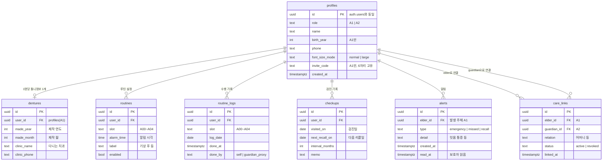

# 03. 데이터 모델 (테이블 정의 + ERD)

> DB: Supabase (PostgreSQL). 로그인 계정은 Supabase Auth(`auth.users`)가 자동 관리하고,
> 우리는 그 위에 서비스 데이터를 얹는다.

## ERD

## 설계 결정 사항

1. **streak/automaticity는 테이블에 저장하지 않는다** — `routine_logs`에서 계산 가능(연속 일수 = 로그 날짜 연속성). 저장하면 로그와 어긋날 위험. 계산 함수를 프론트 공용 유틸로 구현.
2. **리콜 단계(적응기/1년차/안정기/장기)도 저장하지 않는다** — `dentures.made_year/month`에서 항상 계산 (프로토타입 `calculateRecall` 로직 계승).
3. **초대코드는 A1 프로필에 저장** — 가입 시 6자리 무작위 생성, 유니크 제약. A2가 코드 입력 → `care_links` 행 생성.
4. **routine_logs는 (user_id, slot, log_date) 유니크** — 같은 루틴 중복 체크 방지.
5. **알림 시간 기본값**: 07:00 / 08:00 / 12:30 / 19:00 / 22:30 (온보딩에서 수정 가능, routines에 저장).
6. **A3(시설)·A5(관리자)용 테이블은 지금 만들지 않는다** — MVP 검증 후 facilities, facility_members 추가 예정. 현 구조(care_links)가 다대다 관계라 확장 가능.

## 개인정보 원칙

- 수집 최소화: 주민번호·정확한 생년월일 없이 출생연도만
- 건강 정보는 틀니 관련(제작 시기, 관리 기록, 증상 신고)으로 한정
- 보호자는 연결(care_links.status=active)된 어르신의 데이터만 조회 가능 — DB 차원에서 강제(04_API명세.md의 RLS 참고)
